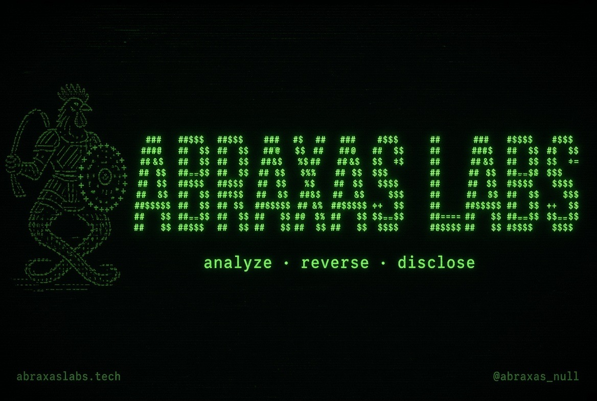
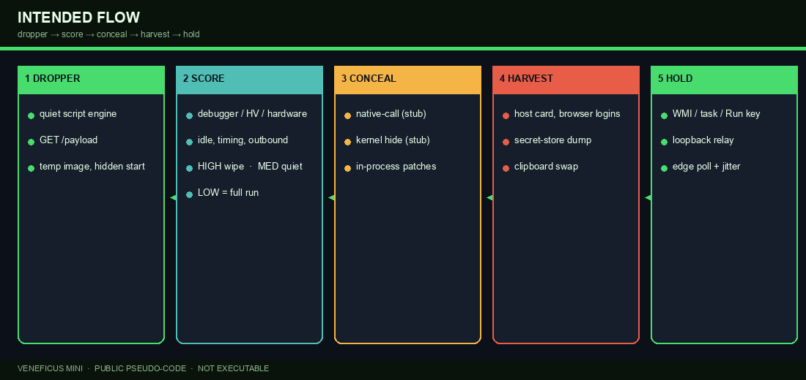
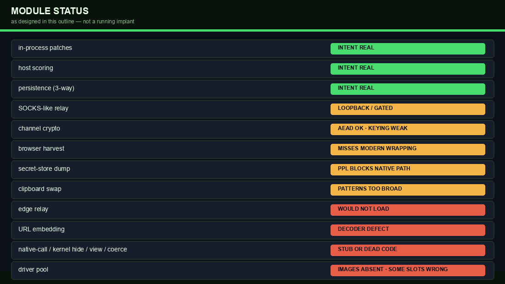
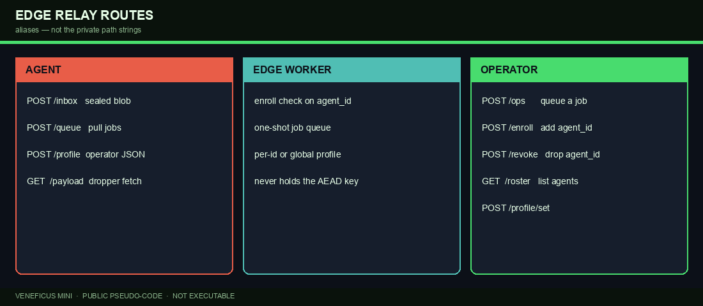

# Veneficus Mini Malware - Exploit, Pivot, C2, Persistence

<p align="center">
  
</p>

<p align="center">
  <strong>Public technical outline</strong> · pseudo-code only · not executable<br>
  <a href="https://abraxaslabs.tech">abraxaslabs.tech</a>
  ·
  <a href="https://x.com/abraxas_null">@abraxas_null</a>
</p>

---

This repository is a **documentation clone** of Veneficus Mini, a Windows x64 implant sketched as a modular agent: host scoring, concealment, a signed-driver helper pool, harvest, persistence, a loopback relay, and an HTTPS edge control plane.

Every module here is **pseudo-code**. It is not a buildable project, not a dropper, and not a detector-friendly dump of a private tree.

| Kept | Removed / aliased |
| --- | --- |
| Product name **Veneficus** | Private function names, types, env vars |
| Public **CVE** identifiers | Vendor product names, exploit nicknames |
| Design, including defects | Driver filenames, device paths, control codes |
| | Host artifacts, XOR keys, patch bytes, regexes |
| | Private relay path strings |

Identifiers in this packet are aliases. A copy of these files should not compile into a YARA rule that hits a private implementation.

---

## Intended flow



1. **Dropper** — quiet the script engine, `GET /payload`, write a throwaway-named image under the user temp directory, start it hidden.
2. **Score** — debugger / hypervisor / hardware / idle / timing / outbound checks. High → wipe and exit. Medium → quiet mode (host card only). Low → full operation.
3. **Conceal** — native-call path (stub), stack-cover (imported, unused), kernel hide (stub), in-process script-scan and telemetry patches (intent is real; bytes omitted).
4. **Driver pool** — try signed-but-vulnerable kernel images as a process-kill helper. Needs admin. Images are not in this repository.
5. **Harvest** — host card, browser logins, OS secret-store dump, clipboard swap. Cookie harvest exists and is never called.
6. **Hold** — WMI pulse / on-logon task / machine Run key, loopback relay, blank view listener, control poll with jitter.

---

## Module status



The private tree is unfinished. This outline keeps the defects visible on purpose.

---

## CVE references

Vendor names withheld. Role names are aliases.

| CVE | Role in the pool | Note |
| --- | --- | --- |
| CVE-2025-1055 / CVE-2025-52915 | AV kernel scanner | Process-kill control code |
| CVE-2024-51324 | Third-party AV utility driver | Process-kill control code |
| CVE-2025-7771 | CPU-tuning driver | Real primitive is physmem R/W, not pid-kill |
| CVE-2025-70795 | DLP process-monitor driver | Process-kill control code |
| CVE-2019-16098 | GPU overlay driver | Virtual R/W; private tree used the wrong code |
| CVE-2025-33073 | SMB client (lateral sketch) | Cited, not implemented; dead code |

---

## Edge relay



Public path aliases: `/payload` `/inbox` `/queue` `/profile` `/ops` `/enroll` `/revoke` `/roster` `/profile/set`.

Sealed blobs use AES-256-GCM. The channel key is derived from the compile-time agent id with no salt — possession of the binary implies possession of the key. The worker never decrypts. Jobs travel in the clear.

---

## Tree

```
Veneficus_Mini/
├── NOTICE.txt
├── project.toml
├── build_id.pseudo
├── notes/build.txt
├── dropper/stage.pseudo
├── relay/edge_relay.pseudo
├── driver_pool/          (empty)
├── helpers/              (empty)
└── src/
    ├── entry.pseudo
    ├── host_profile.pseudo
    ├── channel_crypto.pseudo
    ├── control.pseudo
    ├── driver_assist.pseudo
    ├── stay.pseudo
    ├── local_relay.pseudo
    ├── retire.pseudo
    ├── payload/
    ├── stealth/
    ├── backdoor/
    └── lateral/
```

Start at [`Veneficus_Mini/src/entry.pseudo`](Veneficus_Mini/src/entry.pseudo) and [`Veneficus_Mini/NOTICE.txt`](Veneficus_Mini/NOTICE.txt).

---

## What this is not

- Not a compiler input. `.pseudo` files will not build.
- Not a full implant. Native-call, kernel hide, hidden view, and auth-coerce are stubs or dead code.
- Not a vulnerability disclosure beyond the public CVE IDs listed above.

For operator-facing write-ups see [abraxaslabs.tech](https://abraxaslabs.tech).
